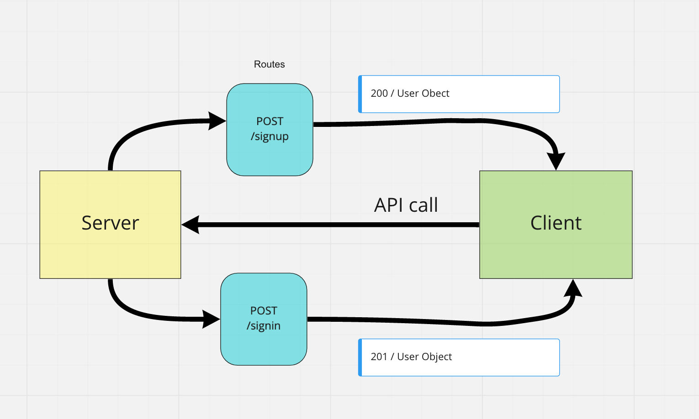

# basic-auth

Created by Harvey Lucas

## Installation

```plaintext
> npm init -y
> npm install dotenv express jest supertest pg sequelize sequelize-cli sqlite3 base64 bcrypt
```

## Summary of Problem Domain

### Lab: Class 06

#### Authentication System Phase 1

Deploy an Express server that implements Basic Authentication, with signup and signin capabilities, using a Postgres database for storage.

## Links to application deployment

PR: https://github.com/tripppdx/basic-auth/pull/3

## Visual



## Routes

```plaintext

- HTTP POST

  - Path: /signup
    1. Make a POST request to the/signup route with username and password
    2. Your server should support both JSON and FORM data as input
    3. On a successful account creation, return a 201 status with the user object in the body
    4. On any error, trigger your error handler with an appropriate error

- HTTP POST

  - Path: /signin
    1. Make a POST request to the /signin route
    2. Send a basic authentication header with a properly encoded username and password combination
    3. On a successful account login, return a 200 status with the user object in the body
    4. On any error, trigger your error handler with the message “Invalid Login”

```
